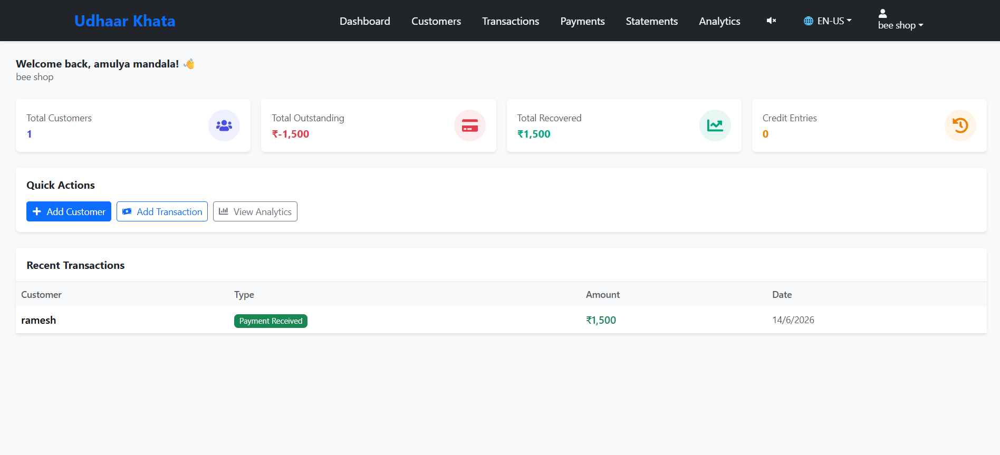
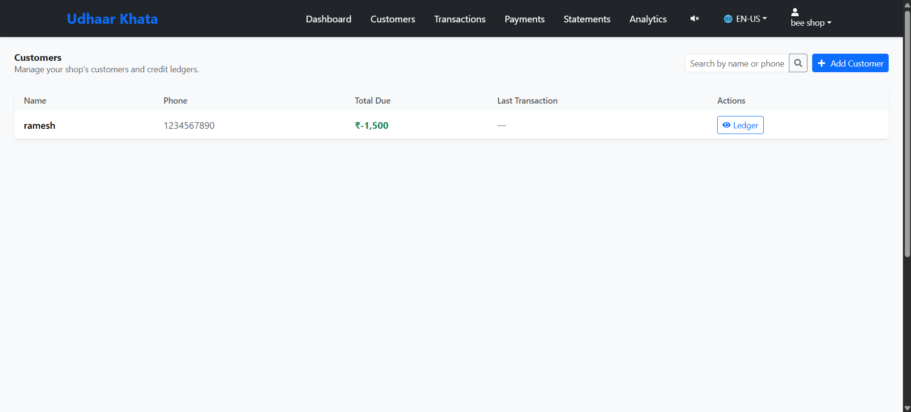
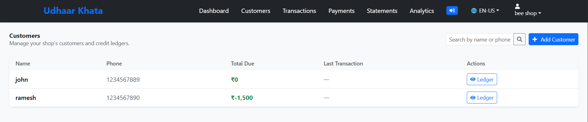
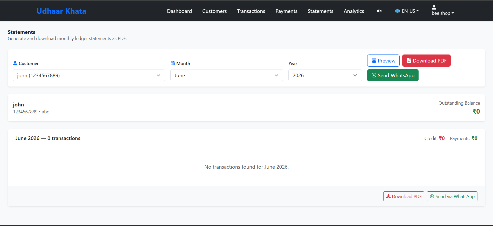

# 🏪 Digital Udhaar Khata


Digital Udhaar Khata is a modern, AI-powered credit ledger management system for local shopkeepers and small businesses. It replaces traditional paper-based *khata* (credit books) with a secure, cloud-based solution that supports voice inputs, automated WhatsApp/SMS reminders, PDF statements, and direct payment link generation.

---

## ✨ Key Features

- **🗣️ Voice-Powered Data Entry**: Shopkeepers can simply speak (e.g., "500 rupees udhaar for Rahul") using the microphone. The system uses OpenAI Whisper to parse the voice command and automatically fill the transaction forms.
- **📱 Automated Reminders (WhatsApp & SMS)**: Generate dynamic, AI-crafted reminder messages (Friendly, Strong, Overdue) in multiple local languages (English, Hindi, Telugu, Tamil) and send them directly to customers via Twilio API.
- **💸 Direct Payment Links**: Generate instant Razorpay payment links and attach them to customer reminders, enabling frictionless debt recovery.
- **📄 Monthly PDF Statements**: Generate professional PDF ledgers using PDFKit, upload them securely to Cloudinary, and share them with customers.
- **🔊 Multilingual Text-to-Speech**: Built-in browser TTS reads out outstanding balances and success messages in the shopkeeper's preferred regional language.
- **👨‍👩‍👧‍👦 Family Khata Grouping**: Link multiple family members under a single primary ledger to track household debt collectively.
- **📊 Analytics & Trust Scores**: Visual dashboard with cash flow metrics and AI-calculated customer "Trust Scores" based on repayment consistency.

---

## 📸 Screenshots

*(Add your screenshots to a `screenshots` folder and update the links below)*

| Dashboard Overview | Customer Ledger |
| :---: | :---: |
|  |  |
| **Voice Transaction Entry** | **AI WhatsApp Reminders** |
|  |  |

---

## 🚀 Quick Start

### Prerequisites
- Node.js (v18+)
- MongoDB connection URI
- Twilio Account (for SMS/WhatsApp)
- Razorpay Account (for payments)
- OpenAI API Key (for voice parsing & AI text)
- Cloudinary Account (for PDF hosting)

### Installation

1. **Clone the repository:**
   ```bash
   git clone https://github.com/yourusername/udhaar-khata.git
   cd udhaar-khata
   ```

2. **Setup Backend:**
   ```bash
   cd backend
   npm install
   # Create a .env file based on .env.example
   npm run dev
   ```

3. **Setup Frontend:**
   ```bash
   cd frontend
   npm install
   # Create a .env file with VITE_API_URL pointing to backend
   npm run dev
   ```

---

## 📁 Repository Structure

This repository is structured as a monorepo containing both the frontend and backend applications.

- [`/frontend`](./frontend/) - React + Vite SPA using Bootstrap, TailwindCSS, and Axios.
- [`/backend`](./backend/) - Node.js + Express REST API backed by MongoDB.

For detailed documentation on the individual environments, please refer to their respective README files.